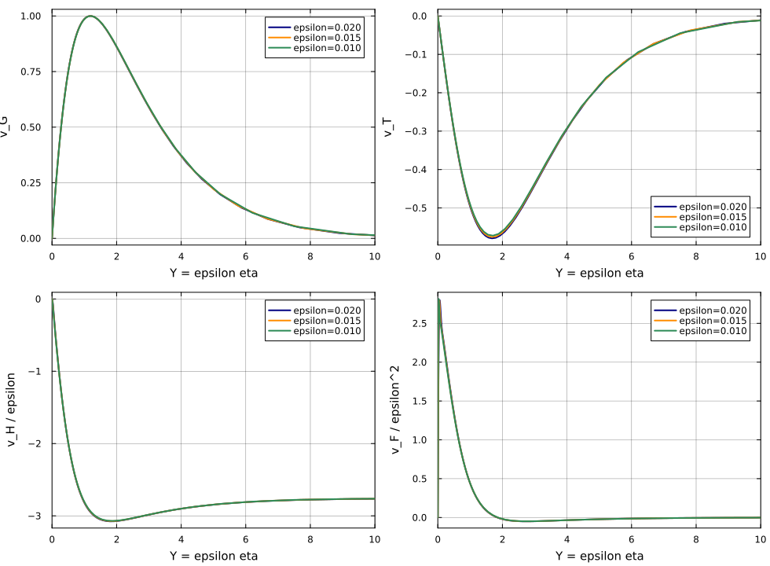
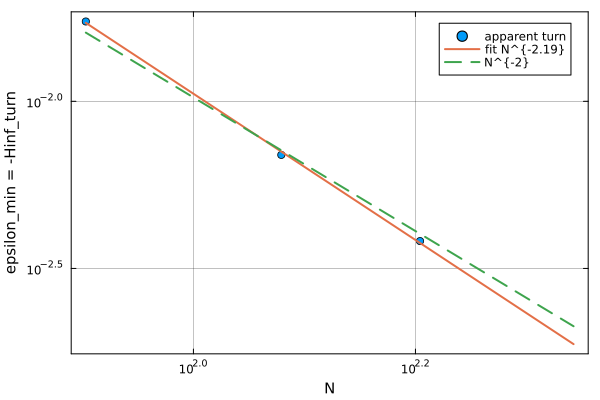

# Resolved tangent window、fold-mode collapse 与 cusp-like 分辨率边界

## 计算范围（计算前登记）

本步骤封闭 L017 尚未完全收敛的数值证据链，不做 outer `O(epsilon^2)`：

1. 在既有 `epsilon=0.02,0.01` 之间新增一个中间 fold 点
   `epsilon=0.015`，对 `N=200,240,280,320` 计算完整增广 tangent；若从
   `N=320` 已有解到 `N=360` 的谱网格升阶校正能够收敛，则把 `N=360` 作为
   额外分辨率检查，但不向更小 epsilon 延拓；
2. 在 `Y=epsilon*eta` 上比较 `N=320` 的 rescaled right null modes：
   `v_G,v_T,v_H/epsilon,v_F/epsilon^2`；
3. 只用已有 `N=80,120,160` apparent-turn 数据估计
   `epsilon_min(N)=-Hinf_turn(N)` 的分辨率标度。

新点仍使用完整自洽一致模型、真无穷映射 `(a,b,c)=(2,0.6,0.5)`、
`Pr=0.72,gamma=1`。它由同一 `N` 的既有 `epsilon=0.02` fold 作初值，通过
`R=0,J_Uv=0,v'v=1,Hinf+epsilon=0` 校正；不构成新的 Ro 切片或模型扫描。

计划输出：tangent convergence 表/图、mode-collapse 图与定量误差、以及
cusp-like resolution-boundary 标度。完成后在本文追加结果并更新总体日志。

## 1. Resolved tangent window

新增 `epsilon=0.015` fold 在 `N=200,240,280,320` 上均收敛；额外从既有
`N=320,epsilon=0.02` 升阶并校正出的 `N=360` 解也成功覆盖三点。完整增广
tangent 的高阶结果为：

| `epsilon` | `N=240` | `N=280` | `N=320` | `N=360` |
|---:|---:|---:|---:|---:|
| 0.020 | -0.439197 | -0.439122 | -0.439141 | -0.439136 |
| 0.015 | -0.434124 | -0.434086 | -0.433978 | -0.434031 |
| 0.010 | -0.426962 | -0.427177 | -0.429914 | -0.428893 |

表中为 `dRo/d epsilon`；`dTw/d epsilon` 表现相同。`N=240--360` 的相对
分辨率散布为：

```text
epsilon=0.020: 1.69e-4,
epsilon=0.015: 3.36e-4,
epsilon=0.010: 6.89e-3.
```

因此清晰的 resolved asymptotic window 是当前的 `0.015 <= epsilon <= 0.02`；
`epsilon=0.01` 已进入导数比坐标更敏感的过渡区，但 `N=320,360` 仍给出光滑、
相近的切向。`N=360` 三点为

```text
epsilon        dRo/d epsilon     dTw/d epsilon
0.020          -0.439135915       0.534333356
0.015          -0.434030559       0.527941807
0.010          -0.428892834       0.521536695
```

只用两个严格 resolved 点 `0.02,0.015` 线性外推，`N=240--360` 给出

```text
A_R = -0.41849 ... -0.41898,
A_T =  0.50849 ...  0.50909.
```

`N=360` 为 `(-0.4187145,0.5087672)`，与 branch-coordinate 拟合
`(-0.4203425,0.5106601)` 相差 `0.39%,0.37%`。这比 L017 单用边缘
`epsilon=0.01,N=320` 得到的 `0.1%` 匹配更保守，也具有明确网格收敛范围。
因此论文应表述为“resolved tangent window 向 branch-fit coefficient 收敛并在
约 `0.4%` 内确认”，不能把较偶然的 `0.08%` 写成完全收敛精度。

## 2. Fold eigenmode 的 outer similarity collapse

在 `N=360` 上，将右零模统一按 `max|v_G|=1` 归一化，并画出

```text
v_G(Y), v_T(Y), v_H(Y)/epsilon, v_F(Y)/epsilon^2,
Y=epsilon*eta.
```

`epsilon=0.02,0.015,0.01` 的四组曲线均塌缩到共同剖面。相对于
`epsilon=0.01`、在 `0<=Y<=10` 的 relative L2 differences 为：

| 比较点 | `v_G` | `v_T` | `v_H/epsilon` | `v_F/epsilon^2` |
|---:|---:|---:|---:|---:|
| 0.020 vs 0.010 | 0.553% | 1.225% | 0.219% | 8.76% |
| 0.015 vs 0.010 | 0.392% | 0.686% | 0.109% | 4.90% |

`v_F` 的相对误差较大是因为其重标度曲线在大部分区间接近零；绝对 RMS 差只有
`0.0435` 和 `0.0243`。其余三场已达到约百分之一或更好的一致性。结合 L017
的幅值标度，这不再只是“阶数正确”，而是直接支持

```text
the full fold eigenfunction possesses an outer similarity limit.
```

即 full-system singularity 没有消失；其 eigenvector 经
`(1,1,epsilon,epsilon^2)` 分量重标度后被吸收到正则 outer 极限结构中。



## 3. Cusp-like resolution layer

已有 primary apparent-turn 数据为

```text
N=80:  epsilon_min=1.73353e-2,
N=120: epsilon_min=6.91296e-3,
N=160: epsilon_min=3.81799e-3.
```

相邻点有效幂次为 `2.267,2.064`，三点 log--log 拟合给

```text
epsilon_min ~ 250.9 N^(-2.188).
```

更有解释力的是

```text
N^2 epsilon_min = 110.95, 99.55, 97.74,
```

正趋向常数，支持渐近 `epsilon_min=O(N^-2)`。该指数可由当前 Pier/rational
Chebyshev 映射直接解释。倒数第二个 Chebyshev 节点满足

```text
1-xi_(N-1) ~ pi^2/(2N^2),
q'(1)=b+(1-b)(3-2c)=1.4,
eta_(N-1) ~ 4/(0.7*pi^2) N^2 = 0.5790 N^2
```

（这里 `a=2,b=0.6,c=0.5`）。热尾长度为 `O(1/epsilon)`，因此当固定数量的
尾部衰减长度逼近最后一个有限映射节点时，自然得到

```text
epsilon_min eta_(N-1)=O(1)
=> epsilon_min=O(N^-2).
```

这给 apparent cusp migration 一个具体离散机制，而不是只观察到它随 N 后退。
三点拟合仍只用于 numerical resolution boundary，不是物理 cusp 标度定律。



## 总结

本步骤把三条证据封闭为一致结论：

1. `epsilon=0.015--0.02` 存在明确的 grid-resolved tangent window，保守外推在
   `0.4%` 内确认既有 `A_R,A_T`；
2. full fold null mode 的四个重标度分量在 `Y=epsilon*eta` 上形成共同 profile；
3. apparent cusp layer 与 `epsilon_min=O(N^-2)` 及映射有限节点尺度一致，属于
   tail-resolution boundary，而不是收敛的物理 cusp。

因此当前可以稳健使用的论文机制是

```text
singular regularisation of a finite-epsilon fold through
thermo-rotational slow-tail rescaling.
```

这一步没有使用或需要 outer `O(epsilon^2)`。

## 输出

- 新中间 fold/tangent：`work/scripts/compute_intermediate_fold_tangent.jl`；
- `N=360` 升阶：`work/scripts/extend_fold_tangent_N360.jl`；
- 汇总和作图：`work/scripts/summarize_tangent_convergence_mode_collapse.jl`；
- 全部数据与图：`work/results/tangent_convergence_mode_collapse/`。
